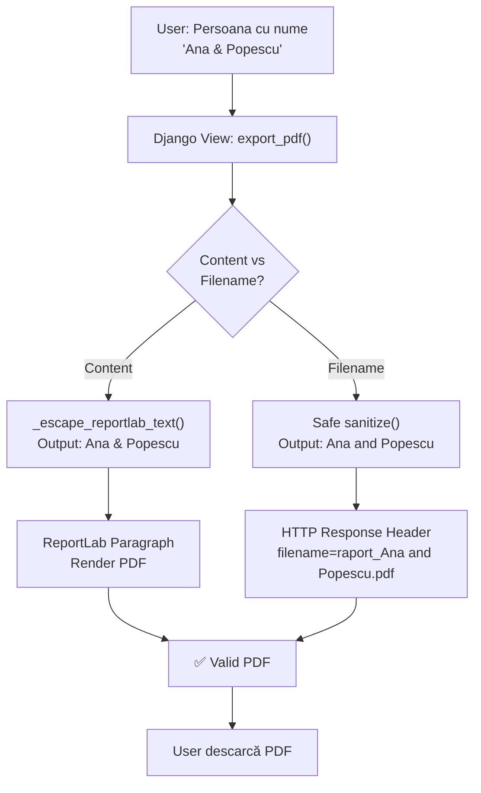
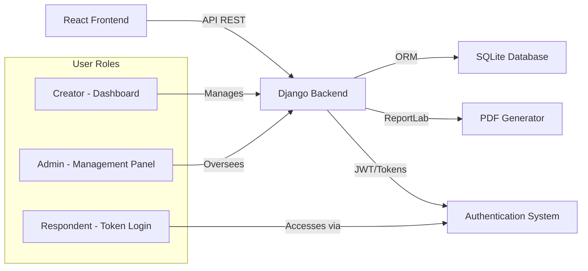

# Turnatoru 🐀

Platforma supremă pentru feedback anonim, sincer și (sperăm) constructiv! Fie că ești un șef care vrea să știe adevărul, un director de școală curios sau un prieten pus pe glume, Turnatoru este locul ideal. 🎭🤐

## 🚀 Funcționalități

Proiectul este structurat pe 3 roluri principale:
* 👑 **Adminul:** Zeul suprem care vede absolut tot (formulare, tokenuri, cereri).
* 📝 **Creatorul:** Își face cont, creează formulare, generează tokenuri și citește "turnătoriile" primite.
* 🕵️‍♂️ **Turnătorul:** Intră direct cu un token secret și lasă feedback 100% anonim, fără bătăi de cap.

## 🛠️ Tehnologii Folosite

* **Backend:** Python & Django 🐍
* **Baza de date:** PostGreSQL 🗄️
* **Frontend:** HTML & CSS (cu o tematică foarte hazlie) 🎨
* **Hosting:** Render ☁️

## 💻 Cum să rulezi proiectul local

```bash
git clone https://github.com/numele-tau/turnatoru.git
cd turnatoru
python -m venv venv
source venv/bin/activate 
pip install -r requirements.txt
python manage.py migrate
python manage.py runserver
```

## 🐛 Bug Fix: PDF Export cu Caractere Speciale

### Problema
Exportul PDF se blocha atunci când nume de persoane conțineau caractere speciale (`&`, `<`, `>`, `"`, `'`).

### Soluție Implementată
Sanitizarea numelui fișierului PDF pentru filesystem, separate de escaping-ul pentru ReportLab:

```python
# Sanitizare filename pentru filesystem
safe_filename = formular.titlu.replace('&', 'and').replace('<', '').replace('>', '').replace('"', '').replace("'", '').replace('/', '_').replace('\\', '_')
```

- **Content escaping:** ReportLab primește entități XML (`&lt;`, `&gt;`, `&amp;`, etc.)
- **Filename escaping:** Sistemul de fișiere primește caractere valide

### Diagrama Flux Fix



### Tehnologii Folosite pentru Fix

| Componență | Tehnologie | Rol |
|---|---|---|
| **Escaping Content** | ReportLab XML Entities | Interpretează `&lt;`, `&gt;`, `&amp;` |
| **Sanitizing Filename** | Python String Methods | Elimină caractere invalide pentru filesystem |
| **Framework** | Django 4.x | Request/Response handling |
| **Database** | SQLite (local) | Stocarea formulare & persoane |
| **Testing** | Manual + Acceptance Criteria | Validare fix |

### Acceptance Criteria ✅
- ✅ PDF-ul se generează corect pentru nume cu `&`, `<`, `>`, ghilimele, apostrof
- ✅ Nu apare excepție în timpul generării
- ✅ PDF-ul se descarcă și se deschide normal
- ✅ Filename-ul e valid pe Windows/Linux/Mac

## 📊 Architetura Proiectului


