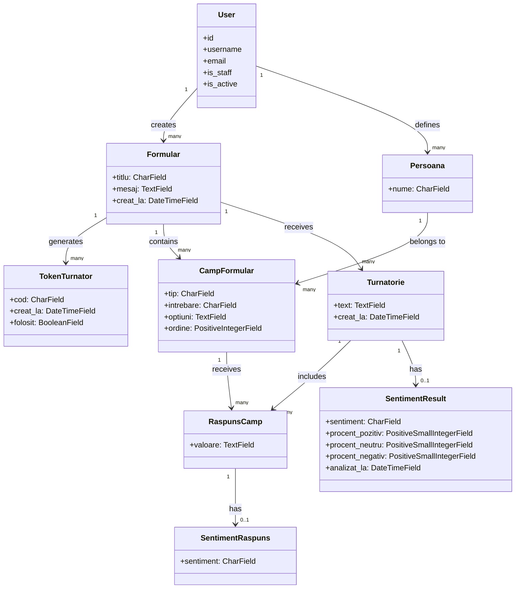
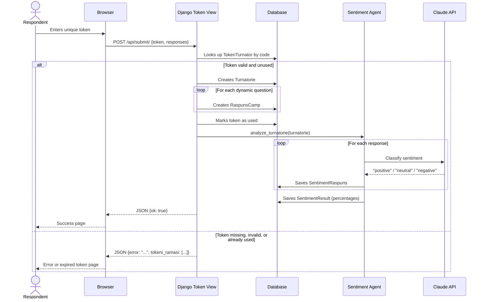

# UML Diagrams for Turnatoru

## Class Diagram

```mermaid
classDiagram
    class User {
        +id
        +username
        +email
        +is_staff
        +is_active
    }

    class Formular {
        +titlu: CharField
        +mesaj: TextField
        +creat_la: DateTimeField
    }

    class TokenTurnator {
        +cod: CharField
        +creat_la: DateTimeField
        +folosit: BooleanField
    }

    class Persoana {
        +nume: CharField
    }

    class CampFormular {
        +tip: CharField
        +intrebare: CharField
        +optiuni: TextField
        +ordine: PositiveIntegerField
    }

    class Turnatorie {
        +text: TextField
        +creat_la: DateTimeField
    }

    class RaspunsCamp {
        +valoare: TextField
    }

    class SentimentResult {
        +sentiment: CharField
        +procent_pozitiv: PositiveSmallIntegerField
        +procent_neutru: PositiveSmallIntegerField
        +procent_negativ: PositiveSmallIntegerField
        +analizat_la: DateTimeField
    }

    class SentimentRaspuns {
        +sentiment: CharField
    }

    User "1" --> "many" Formular : creates
    User "1" --> "many" Persoana : defines
    Formular "1" --> "many" TokenTurnator : generates
    Formular "1" --> "many" CampFormular : contains
    Persoana "1" --> "many" CampFormular : belongs to
    Formular "1" --> "many" Turnatorie : receives
    Turnatorie "1" --> "many" RaspunsCamp : includes
    CampFormular "1" --> "many" RaspunsCamp : receives
    Turnatorie "1" --> "0..1" SentimentResult : has
    RaspunsCamp "1" --> "0..1" SentimentRaspuns : has
```

## Sequence Diagram — Token Submission & Sentiment Analysis

```mermaid
sequenceDiagram
    actor Respondent
    participant Browser
    participant DjangoView as Django Token View
    participant DB as Database
    participant Sentiment as Sentiment Agent
    participant Claude as Claude API

    Respondent->>Browser: Enters unique token
    Browser->>DjangoView: POST /api/submit/ {token, responses}
    DjangoView->>DB: Looks up TokenTurnator by code

    alt Token valid and unused
        DjangoView->>DB: Creates Turnatorie
        loop For each dynamic question
            DjangoView->>DB: Creates RaspunsCamp
        end
        DjangoView->>DB: Marks token as used
        DjangoView->>Sentiment: analyze_turnatorie(turnatorie)
        loop For each response
            Sentiment->>Claude: Classify sentiment
            Claude-->>Sentiment: "positive" / "neutral" / "negative"
            Sentiment->>DB: Saves SentimentRaspuns
        end
        Sentiment->>DB: Saves SentimentResult (percentages)
        DjangoView-->>Browser: JSON {ok: true}
        Browser-->>Respondent: Success page
    else Token missing, invalid, or already used
        DjangoView-->>Browser: JSON {error: "...", tokeni_ramasi: [...]}
        Browser-->>Respondent: Error or expired token page
    end
```
