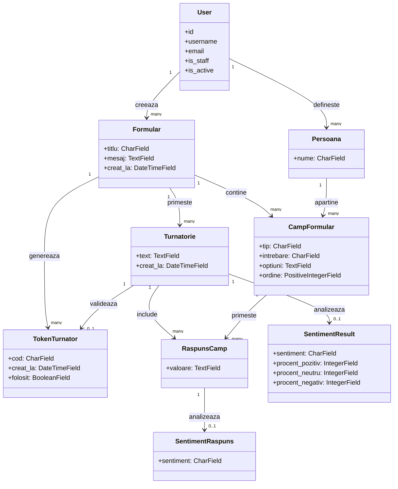
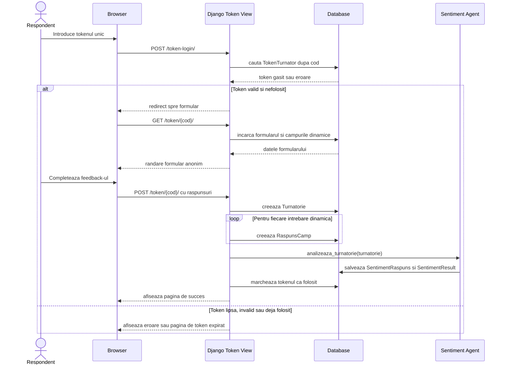

# UML Diagrams for Turnatoru

## Class Diagram

```mermaid
classDiagram
    class User {
        +id
        +username
        +email
        +is_staff
        +is_active
    }

    class Formular {
        +titlu: CharField
        +mesaj: TextField
        +creat_la: DateTimeField
    }

    class TokenTurnator {
        +cod: CharField
        +creat_la: DateTimeField
        +folosit: BooleanField
    }

    class Persoana {
        +nume: CharField
    }

    class CampFormular {
        +tip: CharField
        +intrebare: CharField
        +optiuni: TextField
        +ordine: PositiveIntegerField
    }

    class Turnatorie {
        +text: TextField
        +creat_la: DateTimeField
    }

    class RaspunsCamp {
        +valoare: TextField
    }

    class SentimentResult {
        +sentiment: CharField
        +procent_pozitiv: IntegerField
        +procent_neutru: IntegerField
        +procent_negativ: IntegerField
    }

    class SentimentRaspuns {
        +sentiment: CharField
    }

    User "1" --> "many" Formular : creeaza
    User "1" --> "many" Persoana : defineste
    Formular "1" --> "many" TokenTurnator : genereaza
    Formular "1" --> "many" CampFormular : contine
    Persoana "1" --> "many" CampFormular : apartine
    Formular "1" --> "many" Turnatorie : primeste
    Turnatorie "1" --> "many" RaspunsCamp : include
    CampFormular "1" --> "many" RaspunsCamp : primeste
    Turnatorie "1" --> "0..1" TokenTurnator : valideaza
    Turnatorie "1" --> "0..1" SentimentResult : analizeaza
    RaspunsCamp "1" --> "0..1" SentimentRaspuns : analizeaza
```

## Sequence Diagram

```mermaid
sequenceDiagram
    actor Respondent
    participant Browser
    participant TokenView as Django Token View
    participant DB as Database
    participant Sentiment as Sentiment Agent

    Respondent->>Browser: Introduce tokenul unic
    Browser->>TokenView: POST /token-login/
    TokenView->>DB: cauta TokenTurnator dupa cod
    DB-->>TokenView: token gasit sau eroare

    alt Token valid si nefolosit
        TokenView-->>Browser: redirect spre formular
        Browser->>TokenView: GET /token/{cod}/
        TokenView->>DB: incarca formularul si campurile dinamice
        DB-->>TokenView: datele formularului
        TokenView-->>Browser: randare formular anonim
        Respondent->>Browser: Completeaza feedback-ul
        Browser->>TokenView: POST /token/{cod}/ cu raspunsuri
        TokenView->>DB: creeaza Turnatorie
        loop Pentru fiecare intrebare dinamica
            TokenView->>DB: creeaza RaspunsCamp
        end
        TokenView->>Sentiment: analizeaza_turnatorie(turnatorie)
        Sentiment->>DB: salveaza SentimentRaspuns si SentimentResult
        TokenView->>DB: marcheaza tokenul ca folosit
        TokenView-->>Browser: afiseaza pagina de succes
    else Token lipsa, invalid sau deja folosit
        TokenView-->>Browser: afiseaza eroare sau pagina de token expirat
    end
```
