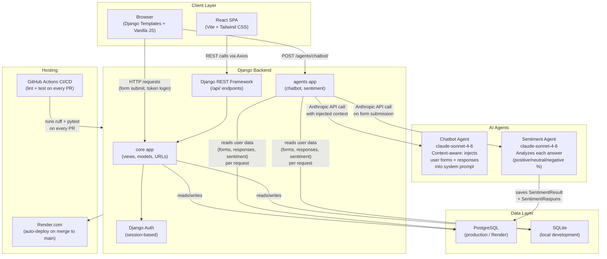

# Component Architecture Diagram — Turnatoru

## Overview

This diagram shows how the main components of the Turnatoru platform interact with each other.



## Component Descriptions

| Component | Technology | Role |
|-----------|-----------|------|
| **Browser (Django Templates)** | HTML/CSS + Vanilla JS | Main user interface for creators and respondents |
| **React SPA** | React 18, Vite, Tailwind CSS | Alternative modern frontend for key pages |
| **core app** | Django 6, Python | Business logic: forms, tokens, responses, PDF export |
| **agents app** | Django + Anthropic SDK | AI chatbot and sentiment analysis services |
| **Django REST Framework** | DRF ViewSets | REST API consumed by the React frontend |
| **Chatbot Agent** | Claude Sonnet 4.6 | Context-aware assistant — receives real user data (forms, answers, sentiment scores) injected into system prompt per request |
| **Sentiment Agent** | Claude Sonnet 4.6 | Analyzes each submitted answer individually, stores positive/neutral/negative percentages |
| **PostgreSQL** | Render free tier | Production database |
| **SQLite** | Local file | Development database |
| **Render.com** | PaaS | Auto-deploys on merge to main via webhook |
| **GitHub Actions** | CI/CD | Runs ruff linter + pytest on every pull request |
```
