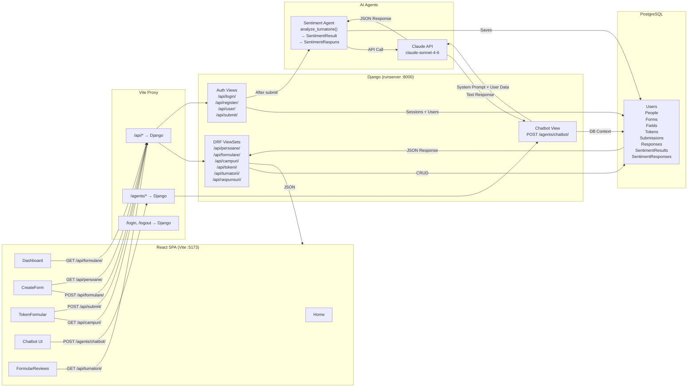

# Data Flow Diagram — Turnatoru

## API Data Flow: How Data Moves Through the System



## Data Flow Steps

### 1. Creator creates a form
```
CreateForm.jsx → POST /api/formulare/ → FormularViewSet.perform_create() → DB
CreateForm.jsx → POST /api/campuri/ (×N) → CampFormularViewSet → DB
```

### 2. Respondent submits feedback
```
TokenFormular.jsx → POST /api/submit/ {token, responses}
  → Validates token (exists + unused)
  → Creates Turnatorie + RaspunsCamp[]
  → Marks token as used
  → Sentiment Agent → Claude API → SentimentResult + SentimentRaspuns
  ← JSON {ok: true}
```

### 3. Chatbot AI
```
Chatbot UI → POST /agents/chatbot/ {messages[]}
  → Injects DB context (forms, responses, sentiment scores)
  → Claude API (system prompt + context + user messages)
  ← JSON {response: "..."}
```

### 4. Creator views reviews
```
FormularReviews.jsx → GET /api/formulare/{id}/
                    → GET /api/campuri/?formular={id}
                    → GET /api/turnatorii/?formular={id}
                    → GET /api/raspunsuri/?turnatorie={id} (×N)
  ← JSON with sentiment_label, persoana_nume, etc.
```
