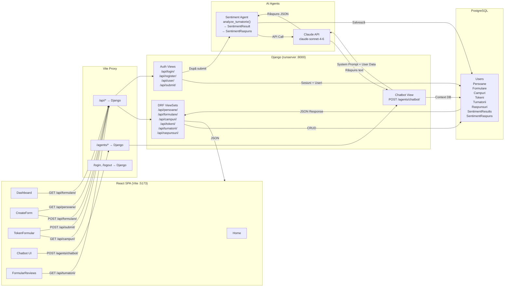

# Data Flow Diagram — Turnatoru

## API Data Flow: Cum circulă datele prin sistem



## Data Flow Steps

### 1. Creator creează formular
```
CreateForm.jsx → POST /api/formulare/ → FormularViewSet.perform_create() → PostgreSQL
CreateForm.jsx → POST /api/campuri/ (×N) → CampFormularViewSet → PostgreSQL
```

### 2. Turnător trimite feedback
```
TokenFormular.jsx → POST /api/submit/ {token, raspunsuri}
  → Verifică token (valid + nefolosit)
  → Creează Turnatorie + RaspunsCamp[]
  → Marchează token folosit
  → Sentiment Agent → Claude API → SentimentResult + SentimentRaspuns
  ← JSON {ok: true}
```

### 3. Chatbot AI
```
Chatbot UI → POST /agents/chatbot/ {messages[]}
  → Injectează context DB (formulare, răspunsuri, sentimente)
  → Claude API (system prompt + context + user messages)
  ← JSON {response: "..."}
```

### 4. Creator vede reviews
```
FormularReviews.jsx → GET /api/formulare/{id}/
                    → GET /api/campuri/?formular={id}
                    → GET /api/turnatorii/?formular={id}
                    → GET /api/raspunsuri/?turnatorie={id} (×N)
  ← JSON cu sentiment_label, persoana_nume, etc.
```
