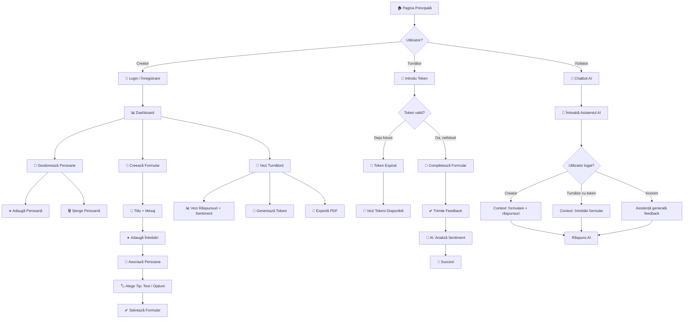

# Workflow Diagram — Turnatoru

## User Journey: Complete Feedback Flow

## Flow Description

1. **Landing**: Userul alege rolul — Creator (creează formulare), Turnător (răspunde anonim), sau folosește Chatbot-ul AI
2. **Creator Flow**: Login → Dashboard → Gestionează persoane → Creează formular cu întrebări dinamice → Generează tokeni → Analizează răspunsuri
3. **Turnător Flow**: Introduce token → Dacă valid: completează formular anonim → AI analizează sentimentul → Succes. Dacă folosit: vede tokeni disponibili
4. **Chatbot AI**: Oferă răspunsuri contextualizate în funcție de rolul utilizatorului
