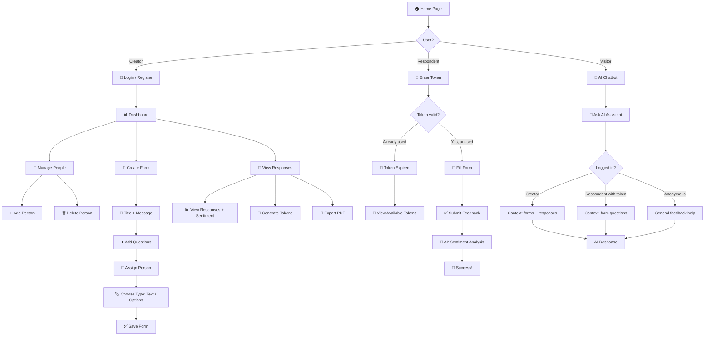

# Workflow Diagram — Turnatoru

## User Journey: Complete Feedback Flow

## Flow Description

1. **Landing**: User chooses role — Creator (creates forms), Respondent (answers anonymously), or uses the AI Chatbot
2. **Creator Flow**: Login → Dashboard → Manage people → Create form with dynamic questions → Generate tokens → Analyze responses
3. **Respondent Flow**: Enter token → If valid: complete anonymous form → AI analyzes sentiment → Success. If used: see available tokens
4. **AI Chatbot**: Provides contextual responses based on user role
